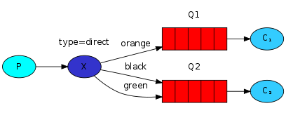

[](https://github.com/danielso2007/cluster_rabbitmq_docker_compose/pulls)
[](https://github.com/danielso2007/cluster_rabbitmq_docker_compose/issues?q=is%3Aopen+is%3Aissue)

[](https://github.com/danielso2007/cluster_rabbitmq_docker_compose/pulls)


[](https://github.com/danielso2007/cluster_rabbitmq_docker_compose)
[](https://github.com/danielso2007/cluster_rabbitmq_docker_compose/archive/master.zip)
[](https://conventionalcommits.org)

<!-- PROJECT LOGO -->
<br />
<p align="center">
  <a href="https://github.com/danielso2007/cluster_rabbitmq_docker_compose">
    
  </a>

  <h3 align="center">Cluster RabbitMQ com Docker Compose</h3>

  <p align="center">
    Exemplo de clusterização do RabbitMQ com docker e proxy reverso
  </p>
</p>

<!-- TABLE OF CONTENTS -->
<details open="open">
  <summary><h2 style="display: inline-block">Table of Contents</h2></summary>
  <ol>
    <li>
      <a href="#about-the-project">About The Project</a>
      <ul>
        <li><a href="#built-with">Built With</a></li>
      </ul>
    </li>
    <li>
      <a href="#getting-started">Getting Started</a>
      <ul>
        <li><a href="#prerequisites">Prerequisites</a></li>
        <li><a href="#installation">Installation</a></li>
      </ul>
    </li>
    <li><a href="#usage">Usage</a>
     <ul>
        <li><a href="#other-commands">Other Commands</a></li>
      </ul>
    </li>
    <li><a href="#roadmap">Roadmap</a></li>
    <li><a href="#contributing">Contributing</a></li>
    <li><a href="#license">License</a></li>
    <li><a href="#introdução">Introdução</a></li>
  </ol>
</details>

<!-- ABOUT THE PROJECT -->

## About The Project

Criação de cluster com [RabbitMQ](https://www.rabbitmq.com/trademark-guidelines.html) e com [haproxy](http://www.haproxy.org/) load balance.

### Built With

- [Docker](https://www.docker.com/)
- [Docker-compose](https://docs.docker.com/compose/)
- [RabbitMQ](https://www.rabbitmq.com/trademark-guidelines.html)
- [haproxy](http://www.haproxy.org/)

<!-- GETTING STARTED -->

## Getting Started

É necessário instalar o docker e o docker-compose apenas.

### Prerequisites

É importante qe você tenha acesso a **sudo** de usa máquina.

### Installation

Apenas baixe os arquivos desse repositório.

<!-- USAGE EXAMPLES -->

## Usage

1. Execute o arquivo `create-haproxy-rabbitmq-cluster.sh` para criar a imagem do proxy (execute apenas uma vez);
2. Execute o arquivo `create.sh` para criar e "subir" os nodes;
   2.1. Neste momento serão criados variáveis de ambiente para a configuração dos clusters;
   2.2. É iniciado os dockers em background `docker-compose up -d`;
   2.3. Depois para cada node, é configurado o node principal.
3. Para acessar o RabbitMQ principal, utilize a url [http://localhost:15671/#/](http://localhost:15671/#/);
   3.1. Utilize o login: **quest** e senha **quest**;
4. Neste momento o load balance também será iniciado;
   4.1. Acesse pelo endereço [http://localhost:1936/](http://localhost:1936/);
   4.2. Utilize o login: **haproxy** e senha **haproxy**;

### Other Commands

- `start.sh`: Inicia os containers.
- `stop.sh`: Para dos containers.
- `exec-it-01.sh`: Acessa o container node-1.
- `exec-it-02.sh`: Acessa o container node-2.
- `logs.sh`: Exibe os logs dos containers.
- `remove.sh`: Para os containers e os remove.
- `remove_volumes.sh`: Para os containers, os remove e apaga todos os volumes.
- `storage-remove.sh`: Remove a pasta storage;
- `add-user.sh [username] [vhost]`: Adiciona novo usuário no RabbitMQ;
- `delete-user.sh [username]`: Remove um usuário no node RabbitMQ.

## Projeto de teste

Há um projeto de teste em nodejs na pasta [exemplo_nodejs](exemplo_nodejs/README.md).

## Roadmap

Consulte os [open issues](https://github.com/danielso2007/cluster_rabbitmq_docker_compose/issues) para obter uma lista de recursos propostos (e problemas conhecidos).

<!-- CONTRIBUTING -->

## Contributing

As contribuições são o que torna a comunidade de código aberto um lugar incrível para aprender, inspirar e criar. Quaisquer contribuições que você fizer são **muito apreciadas**.

1. Faça um fork do projeto
2. Crie seu Feature Branch (`git checkout -b feature/AmazingFeature`)
3. Faça commit de suas alterações (`git commit -m 'Add some AmazingFeature'`)
4. Envie para o Branch (`git push origin feature/AmazingFeature`)
5. Abra uma solicitação pull

<!-- LICENSE -->

## License

Distribuído sob a licença Apache License 2.0. Veja `LICENSE` para mais informações.

# Introdução

RabbitMQ é um agente de mensagens: aceita e encaminha mensagens. Você pode pensar nisso como uma agência de correio: quando você coloca a correspondência que deseja postar em uma caixa de correio, pode ter certeza de que o Sr. ou Sra. Carteiro entregará a correspondência ao destinatário. Nesta analogia, RabbitMQ é uma caixa postal, uma agência dos correios e um carteiro.

A principal diferença entre o RabbitMQ e os correios é que ele não lida com papel, ao invés disso, ele aceita, armazena e encaminha blobs binários de dados - mensagens.

O RabbitMQ e as mensagens em geral usam alguns jargões.

- **Producer** significa nada mais do que enviar. Um programa que envia mensagens é um **producer**:


- Uma **queue** é o nome de uma caixa de correio que vive dentro do RabbitMQ. Embora as mensagens fluam pelo RabbitMQ e seus aplicativos, elas só podem ser armazenadas em uma fila . Uma queue é limitada apenas pelos limites de memória e disco do host, é essencialmente um grande buffer de mensagem. Muitos produtores podem enviar mensagens que vão para uma fila e muitos consumidores podem tentar receber dados de uma fila . É assim que representamos uma **queue**:


- **Consuming** tem um significado semelhante a receber. Um **consumer** é um programa que geralmente espera receber mensagens:


Observe que o produtor, o consumidor e o corretor não precisam residir no mesmo host; na verdade, na maioria dos aplicativos, não. Um aplicativo pode ser produtor e consumidor também.

# [Confirmação de mensagem (Message acknowledgment)](https://www.rabbitmq.com/tutorials/tutorial-two-python.html#Message%20acknowledgment)

A execução de uma tarefa pode demorar alguns segundos. Você pode se perguntar o que acontece se um dos consumidores começa uma tarefa longa e morre com ela apenas parcialmente concluída. Com nosso código atual, uma vez que o RabbitMQ entrega a mensagem ao consumidor, ele imediatamente a marca para exclusão. Nesse caso, se você matar um trabalhador, perderemos a mensagem que ele estava apenas processando. Também perderemos todas as mensagens que foram enviadas para este trabalhador específico, mas ainda não foram tratadas.

Mas não queremos perder nenhuma tarefa. Se um trabalhador morrer, gostaríamos que a tarefa fosse entregue a outro trabalhador.

Para garantir que uma mensagem nunca seja perdida, o RabbitMQ suporta confirmações de mensagens . Um ack (nowledgement) é enviado de volta pelo consumidor para dizer ao RabbitMQ que uma determinada mensagem foi recebida, processada e que o RabbitMQ está livre para excluí-la.

Se um consumidor morre (seu canal é fechado, a conexão é fechada ou a conexão TCP é perdida) sem enviar um ack, o RabbitMQ entenderá que uma mensagem não foi totalmente processada e a enfileirará novamente. Se houver outros consumidores online ao mesmo tempo, ele o reenviará rapidamente para outro consumidor. Dessa forma, você pode ter certeza de que nenhuma mensagem será perdida, mesmo que os trabalhadores morram ocasionalmente.

Não há nenhum tempo limite de mensagem; O RabbitMQ entregará a mensagem novamente quando o consumidor morrer. Tudo bem, mesmo que o processamento de uma mensagem demore muito, muito tempo.

Manual message acknowledgments are turned on by default. In previous examples we explicitly turned them off via the `auto_ack=True` flag. It's time to remove this flag and send a proper acknowledgment from the worker, once we're done with a task.

# fanout


Existem alguns tipos de troca disponíveis: `direct`, `topic`, `headers` and `fanout`. Vamos nos concentrar no último - o `fanout`. Vamos criar uma troca desse tipo e chamá-la de logs (Python):

```
channel.exchange_declare(exchange='logs', exchange_type='fanout')
```
A troca de `fanout` é muito simples. Como você provavelmente pode adivinhar pelo nome, ele apenas transmite todas as mensagens que recebe para todas as filas que conhece. E isso é exatamente o que precisamos para nosso logger.

Agora, podemos publicar em nossa troca nomeada:

```
channel.basic_publish(exchange='logs', routing_key='', body=message)
```

# Direct exchange

Nosso sistema de registro do tutorial anterior transmite todas as mensagens para todos os consumidores. Queremos estender isso para permitir a filtragem de mensagens com base em sua gravidade. Por exemplo, podemos querer que o script que está gravando mensagens de log no disco receba apenas erros críticos e não desperdice espaço em disco com mensagens de log de informações ou de aviso.

Estávamos usando um `fanout` exchange, o que não nos dá muita flexibilidade - ele só é capaz de transmitir sem pensar.

Em vez disso, usaremos uma `Direct exchange`. O algoritmo de roteamento por trás de uma `troca direta` é simples - uma mensagem vai para as filas cuja `chave de ligação`(binding key) corresponde exatamente à `chave de roteamento` (routing key) da mensagem.

Para ilustrar isso, considere a seguinte configuração:



Nesta configuração, podemos ver a troca direta X com duas filas vinculadas a ela. A primeira fila está ligada com a chave de ligação laranja e a segunda tem duas ligações, uma com a chave de ligação preta e a outra com a verde .

Em tal configuração, uma mensagem publicada na central com uma chave de roteamento laranja será roteada para a fila Q1 . Mensagens com uma chave de roteamento preta ou verde irão para Q2 . Todas as outras mensagens serão descartadas.

# Topic exchange (Troca de tema)

As mensagens enviadas para uma `Topic exchange` não podem ter um `routing_key` arbitrário - deve ser uma lista de palavras, delimitada por pontos. As palavras podem ser qualquer coisa, mas geralmente especificam alguns recursos conectados à mensagem. Alguns exemplos de chave de roteamento válidos: `"stock.usd.nyse"`, `"nyse.vmw"`, `"quick.orange.rabbit"`. Pode haver quantas palavras você quiser na chave de roteamento, até o limite de 255 bytes.

A chave de ligação também deve estar no mesmo formato. A lógica por trás da `Topic exchange` é semelhante a uma `direct` - uma mensagem enviada com uma chave de roteamento específica será entregue a todas as filas vinculadas a uma chave de ligação correspondente. No entanto, existem dois casos especiais importantes para chaves de ligação:

`*` (star) pode substituir exatamente uma palavra.
`#` (hash) pode substituir zero ou mais palavras.

É mais fácil explicar isso em um exemplo:


Neste exemplo, vamos enviar mensagens que descrevem animais. As mensagens serão enviadas com uma chave de roteamento composta por três palavras (dois pontos). A primeira palavra na chave de roteamento descreverá uma velocidade, a segunda uma cor e a terceira uma espécie: `"<celeridade>.<colour>.<species>"`.

Criamos três vínculos: Q1 é vinculado com a chave de vinculação `"*.orange.*"` e Q2 com `"*.*.Rabbit"` e `"lazy.#"`.

Essas ligações podem ser resumidas como:

- Q1 está interessado em todos os animais orange.
- Q2 quer ouvir tudo sobre Rabbit e tudo sobre animais lazy.

Uma mensagem com uma chave de roteamento definida como `"quick.orange.rabbit"` será entregue a ambas as filas. A mensagem `"lazy.orange.elephant"` também irá para os dois. Por outro lado, `"quick.orange.fox"` irá apenas para a primeira fila e `"lazy.brown.fox"` apenas para a segunda. `"lazy.pink.rabbit"` será entregue à segunda fila apenas uma vez, embora corresponda a duas ligações. `"quick.brown.fox"` não corresponde a nenhum vínculo, portanto, será descartado.

O que acontece se quebrarmos nosso contrato e enviarmos uma mensagem com uma ou quatro palavras, como `"orange"` ou `"quick.orange.male.rabbit"`? Bem, essas mensagens não corresponderão a nenhum vínculo e serão perdidas.

Por outro lado, `"lazy.orange.male.rabbit"`, embora tenha quatro palavras, irá corresponder à última ligação e será entregue na segunda fila.

#### A troca de tópicos é poderosa e pode se comportar como outras trocas.

Quando uma fila é vinculada com a chave de ligação "#" (hash) - ela receberá todas as mensagens, independentemente da chave de roteamento - como na troca de fanout.

Quando os caracteres especiais "*" (estrela) e "#" (hash) não são usados ​​nas ligações, a troca de tópico se comporta como uma direta.

# Remote Procedure Call ou RPC

[Ver documentação aqui.](https://www.rabbitmq.com/tutorials/tutorial-six-python.html)

Mas e se precisarmos executar uma função em um computador remoto e esperar o resultado? Bem, essa é uma história diferente. Esse padrão é comumente conhecido como Remote Procedure Call ou RPC .

Neste tutorial, vamos usar RabbitMQ para construir um sistema RPC: um cliente e um servidor RPC escalonável. Como não temos tarefas demoradas que valham a pena distribuir, vamos criar um serviço RPC fictício que retorna números de Fibonacci.

### Interface do cliente

Para ilustrar como um serviço RPC pode ser usado, vamos criar uma classe de cliente simples. Ele vai expor um método chamado `call` que envia uma solicitação RPC e bloqueia até que a resposta seja recebida:

```
fibonacci_rpc = FibonacciRpcClient()
result = fibonacci_rpc.call(4)
print("fib(4) is %r" % result)
```
#### Uma nota sobre RPC
Embora o RPC seja um padrão bastante comum na computação, é frequentemente criticado. Os problemas surgem quando um programador não sabe se uma chamada de função é local ou se é um RPC lento. Confusões como essa resultam em um sistema imprevisível e adiciona complexidade desnecessária à depuração. Em vez de simplificar o software, o RPC usado incorretamente pode resultar em código espaguete impossível de manter.

Tendo isso em mente, considere o seguinte conselho:

- Certifique-se de que é óbvio qual chamada de função é local e qual é remota.
- Documente seu sistema. Deixe claras as dependências entre os componentes.
- Trate os casos de erro. Como o cliente deve reagir quando o servidor RPC ficar inativo por muito tempo?

Em caso de dúvida, evite RPC. Se possível, você deve usar um pipeline assíncrono - em vez de bloqueio do tipo RPC, os resultados são enviados de forma assíncrona para um próximo estágio de computação.

### Fila de retorno

Em geral, fazer RPC sobre RabbitMQ é fácil. Um cliente envia uma mensagem de solicitação e um servidor responde com uma mensagem de resposta. Para receber uma resposta, o cliente precisa enviar um endereço de fila de 'retorno de chamada' com a solicitação. Vamos tentar:

```
result = channel.queue_declare(queue='', exclusive=True)
callback_queue = result.method.queue

channel.basic_publish(exchange='',
                      routing_key='rpc_queue',
                      properties=pika.BasicProperties(
                            reply_to = callback_queue,
                            ),
                      body=request)

# ... and some code to read a response message from the callback_queue ...
```

#### Propriedades da mensagem
O protocolo AMQP 0-9-1 pré-define um conjunto de 14 propriedades que acompanham uma mensagem. A maioria das propriedades raramente é usada, com exceção das seguintes:

* `delivery_mode` : marca uma mensagem como persistente (com um valor de `2`) ou transitória (qualquer outro valor). Você deve se lembrar dessa propriedade do segundo tutorial .
* `content_type` : usado para descrever o tipo mime da codificação. Por exemplo, para a codificação JSON freqüentemente usada, é uma boa prática definir essa propriedade como: `application/json`.
* `reply_to` : normalmente usado para nomear uma fila de retorno de chamada.
* `correlação_id` : útil para correlacionar respostas RPC com solicitações.

### ID de correlação

No método apresentado acima, sugerimos a criação de uma fila de retorno de chamada para cada solicitação RPC. Isso é muito ineficiente, mas felizmente há uma maneira melhor - vamos criar uma única fila de retorno de chamada por cliente.

Isso levanta um novo problema, tendo recebido uma resposta naquela fila, não está claro a qual solicitação a resposta pertence. É então que a propriedade `correlation_id` é usada. Vamos defini-lo com um valor único para cada solicitação. Posteriormente, quando recebermos uma mensagem na fila de retorno de chamada, examinaremos essa propriedade e, com base nisso, poderemos corresponder uma resposta a uma solicitação. Se virmos um valor de `correlation_id` desconhecido , podemos descartar a mensagem com segurança - ela não pertence às nossas solicitações.

Você pode perguntar, por que devemos ignorar mensagens desconhecidas na fila de retorno de chamada, em vez de falhar com um erro? É devido à possibilidade de uma condição de corrida no lado do servidor. Embora improvável, é possível que o servidor RPC morra logo após nos enviar a resposta, mas antes de enviar uma mensagem de confirmação da solicitação. Se isso acontecer, o servidor RPC reiniciado processará a solicitação novamente. É por isso que no cliente devemos lidar com as respostas duplicadas normalmente, e o RPC deve ser idealmente idempotente.


Nosso RPC funcionará assim:

* Quando o Cliente é inicializado, ele cria uma fila de retorno de chamada exclusiva anônima.
* Para uma solicitação RPC, o cliente envia uma mensagem com duas propriedades: reply_to , que é definido para a fila de retorno de chamada e correlação_id , que é definido com um valor único para cada solicitação.
* A solicitação é enviada para uma fila rpc_queue .
* O trabalhador RPC (também conhecido como: servidor) está esperando por solicitações nessa fila. Quando uma solicitação aparece, ele realiza o trabalho e envia uma mensagem com o resultado de volta ao Cliente, usando a fila do campo reply_to .
* O cliente espera por dados na fila de retorno de chamada. Quando uma mensagem aparece, ele verifica a propriedade Correlation_id . Se corresponder ao valor da solicitação, ele retornará a resposta ao aplicativo.